[//]: # (
)

## Software Requirements Specification
___

### 1. Introduction

FlaskReddit is a minimalist Reddit clone. It is build in Python
with the Flask library. 

---
### 2. Purpose

The purpose is to create a simple CRUD-based application that can be interacted with
via an API client such as Postman or through the web interface via a browser.
This project was built to test my skills and learn the flow of creating a web application from the ground up.

---
### 3. Scope (libraries, dependencies etc)

Two data models are implemented on a PostgreSQL database with one-to-one, one-to-many and many-to-many relationships.
One database for testing/development and another database for production. These are hosted on a single AWS EC2 instance.
Closer to production the code will be hosted on a separate EC2 instance.

I have utilised the following:

* `flask` as the web framework 
* `PostgreSQL` as the database
* `SQLAlchemy` for my Object Relational Mapping (ORM) - How the application interfaces with the database
* `Marshmallow` is used to serialise, deserialise and validate data to and from the database and application
* `flask-migrate` is used to handle database migrations during development, testing and production
* `jwt_entended` handles some authorisation and authentication
* `bootstrap` for the presentation of our front end. 
* `Jinja` for templating html/css

---
#### 3.1 Database Entity Diagram

.png)
---
#### 3.2 Database Tables

Datebase tables are created through ORM [models](models) and serialised through Marshmallow [schemas](schemas)

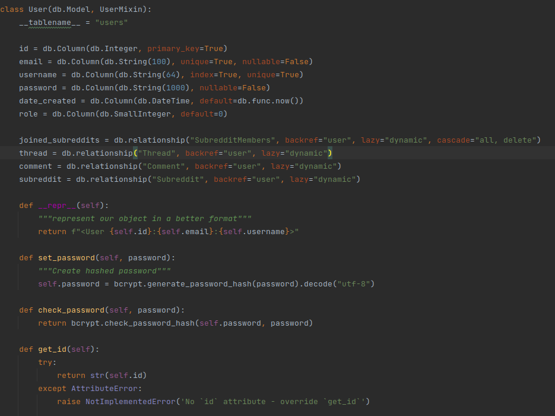

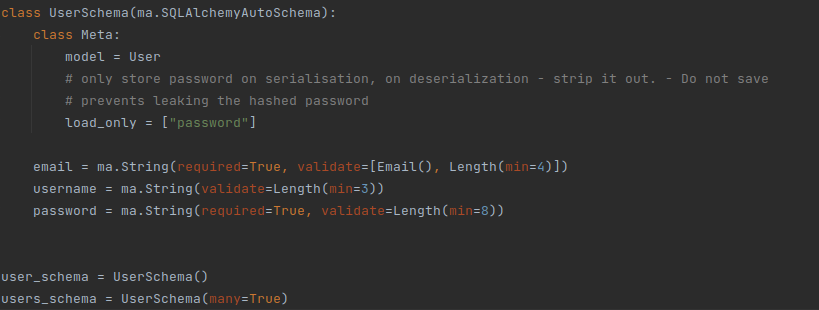

---
#### 3.3 API Endpoints
[Raw format](docs/HarryCashel-FlaskReddit-1.0.0-resolved.yaml)

[OpenApi](https://app.swaggerhub.com/apis-docs/HarryCashel/FlaskReddit/1.0.0#/)

* Access: Using API client such as Postman or Insomnia.
* Authentication and authorisation: API authentication is done with JWT and requires the token
be included in the header for the endpoints that require authorisation
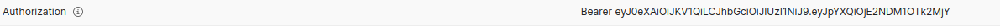

* Token is received by submitting valid credentials to the login endpoints
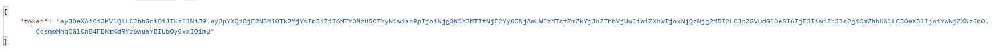

* Endpoints that require body will accept JSON
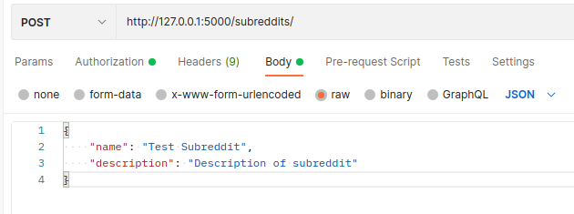

* Responses will also be received in JSON format  
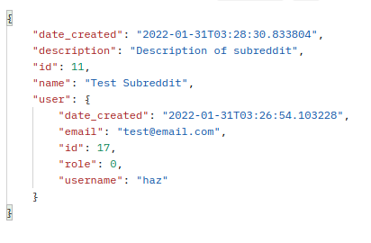

* Validation and error handling: Data is validated via the ORM and Marshmallow schemas.
Error messages are sent back to the user.  
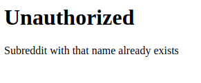  
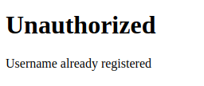  
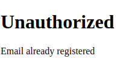

---
#### 3.3.1 Web application

* Access: Via a web browser

* Authentication and authorisation: Managed through the use of cookies and JWTs through flask-login and JWTManager 
to maintain a Stateful session for a logged-in user

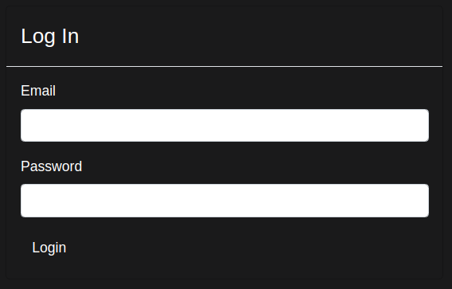
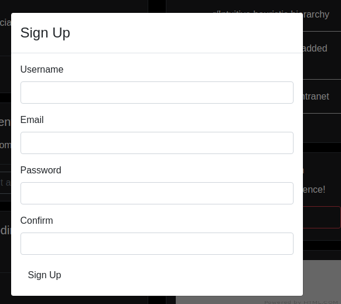
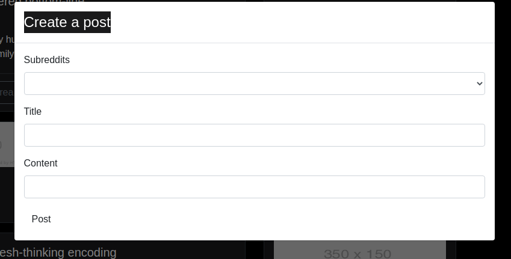

---
#### 3.4 Functionalities

* Functionalities

  ##### Users
  * User registration
  * User login
  * User logout
  * View user owned subreddits/threads/comments
  * Update user details
  * Delete user account

  #### Subreddits
  * View all subreddits
  * Show subreddits by id
  * Create a new subreddit
  * Update subreddit (owner/admin)
  * Join a subreddit
  * Leave a subreddit (member only)
  * Delete a subreddit (owner/admin)
  * Get list of user joined subreddits 
  * View all threads of specific subreddit
  
  #### Threads
  * Get all threads (API only)
  * Create thread (member of subreddit)
  * Update thread (owner only)
  * Delete thread (owner only)
  * Get thread by id
  * Create comment
  * Update comment
  * Delete comment

---
### 4. Installation

___
#### 4.1 Project and Environment Setup

---
#### 4.2 File Structure

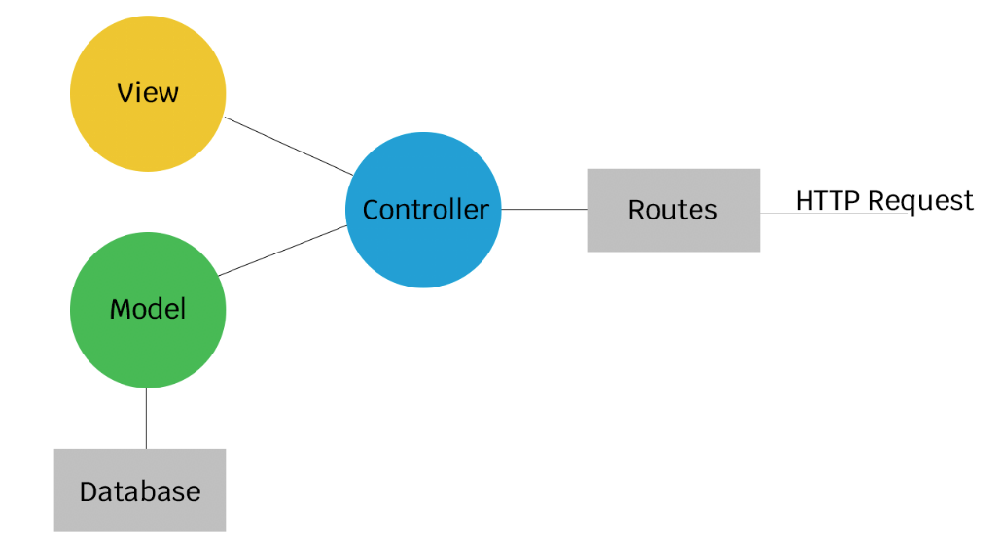

I have utilised the Model, View, Controller architectural pattern through the use of the Flask framework.
The file structure has been created to implement this.

* [README.md](README.md) - This document
* [docs](docs) - Contains links and images used in this README
* [requirements](requirements.txt) - Dependencies to be installed to a new environment for the application to be functional
* [main.py](main.py) - The main flask application, registration and initiation of flask app with supporting libraries
* [settings.py](settings.py) - Default settings for different environments (testing/development)
* [commands.py](commands.py) - Custom commands accessed via the command line interface
* [.env.example](env.example) - .env template to be populated during setup
* [forms](forms.py) - Wtforms for generating forms on the web interface, processed through
the relevant controllers and rendered in the appropriate templates
* [templates](templates) - Jinja2 templates for rendering web pages through the web application routes
* [controllers](controllers) - Application logic, request handling and route definition for the API and web application
endpoints
* [models](models) - SQLAlchemy ORM models that interact with the database. This is where the database tables
are defined
* [schemas](schemas) - SQLAlchemy Marshmallow schemas for serialisation and deserialisation of data. Contains the logic
for validation of data to and from the database and enables the application to interact with the database
* [migrations](migrations) - Database migration files to update database to the latest state defined in this directory

___
#### 4.3 Set Up Databases (Testing and Development)

---
#### 4.4 Run Migrations

---
#### 4.5 Run Automated Tests

---
#### 4.6 Running the application on an AWS EC2 Instance

---
### 5. Continuous Integration/Continuous Deployment

---

[//]: # (
)