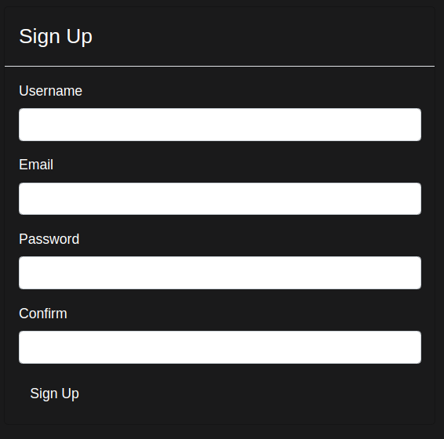

[//]: # (<div style="text-align: center;">)

## Software Requirements Specification
___

### 1. Introduction

FlaskReddit is a minimalist Reddit clone. It is build in Python
with the Flask library. 

---
### 2. Purpose

The purpose is to create a simple CRUD-based application that can be interacted with
via an API client such as Postman or through the web interface via a browser.


I built this project to test my skills and learn the flow of creating a web application from the ground up. I have 
utilised my own knowledge of Python, Postregsql, Amazon Web Services and networking to code an API, an application and host a database
on the cloud. I used this application to perfect what I know and research and learn what I do not. Above all this was a
passion project with the intention to display my knowledge.


---
### 3. Scope (Libraries, Dependencies, Networks, Frameworks, etc.)

This section will detail my process of developing the databases, file structure and source code. 
I encountered several pathways I could have taken while developing this application, and I chose what was most
appropriate for the desired result.

I have utilised the following:

* `flask` as the web framework 
* `PostgreSQL` as the database
* `SQLAlchemy` for my Object Relational Mapping (ORM) - How the application interfaces with the database
* `Marshmallow` is used to serialise, deserialise and validate data to and from the database and application
* `flask-migrate` is used to handle database migrations during development, testing and production
* `jwt_entended` handles some authorisation and authentication
* `bootstrap` for the presentation of our front end. 
* `Jinja` for templating html/css

Flask is an unopinionated web-framework and doesn't make decisions for the developer. This gave me the freedom to 
choose libraries I wanted to use and how to set up my source code. Flask is **configuration over convention** and
I prefer that over frameworks like *Django* that are **convention over configuration**. Flask has been used by
companies such as Netflix, Uber and appropriately, Reddit.

Postgresql is an open-source object-relational database with 30 years of active development. A relational database
is the most appropriate database,  and I chose SQL (Structured Query Language) for simplicity and my familiarity.
Postgres is used by Spotify, Netflix and Reddit.

SQLAlchemy is the most popular Python library for SQL. The application utilises this library to connect to the database
and the logic for the models are created using SQLAlchemy.

Two data models are implemented on a PostgreSQL database with one-to-one, one-to-many and many-to-many relationships.
One database for testing/development and another database for production. These are hosted on an AWS EC2 instance
in a private subnet.
The application is hosted on a public ec2 instance and both the application and the database are within the same VPC
(Virtual Private Cloud)

Data is serialised and deserialised using the Marshmallow library. Schemas are created with Marshmallow by passing
the models created with SQLAlchemy through to Marshmallow. Validation of data is also handled when declaring schemas.


---
#### 3.1 Database Entity Diagram

The figure below is the database diagram that was created in planning stage to be used as a reference when coding
the database. Postgres is a relational database management system that was chosen due to my familiarity and how suited
it is to my database requirements.

.png)
---
#### 3.2 Database Tables

Database tables are created through ORM [models](models) and serialised through Marshmallow [schemas](schemas).
This example highlights how the tables we see in the ERD figure are actually coded in Python, using the SQLAlchemy
framework. This framework gives me the power to let my Python code handle SQL queries rather than writing raw SQL. 
This class models the User table and it's relationships with other tables.


Schemas are created in Python using the Marshmallow library. Marshmallow is an Object Relationship Mapping framework - 
it is used to convert datatypes. In this use case, this library is used to convert data
from a Python datatype to a JSON string(serialise), convert data from JSON to a Python object(deserialise), 
and to validate data to and from the database.
To be clear; serialisation is taking an object and converting into a representative piece of data and deserialisation
is taking the representative piece of data and converting it into an object that can be used, in this case, in Python.

This is how the application "talks" to the database and the API.


---
#### 3.3 API Endpoints
The raw YAML file I wrote to document the API endpoints.
[Raw format](docs/HarryCashel-FlaskReddit-1.0.0-resolved.yaml)

An interactive API document.
[OpenApi](https://app.swaggerhub.com/apis-docs/HarryCashel/FlaskReddit/1.0.0#/)


* Access: The API can be interacted with using API client such as Postman or Insomnia


* Authentication and authorisation: API authentication is done with JWT and requires the token
be included in the header for the endpoints that require authorisation


* A token is received by submitting valid credentials to the login endpoints


* Endpoints that require a body will accept JSON


* Responses will also be received in JSON format  


* Validation and error handling: Data is validated via the ORM and Marshmallow schemas.
Error messages are sent back to the user, for examples see the images below.

Subreddit names much be unique


  
  


---
#### 3.3.1 Web application

* Access: The web application is accessed like any other, through a web browser.


* Authentication and authorisation: Managed through the use of cookies and JWTs through flask-login and JWTManager 
to maintain a Stateful session for a logged-in user





---
#### 3.4 Functionalities

* Functionalities

  ##### Users
  * User registration
  * User login
  * User logout
  * View user owned subreddits/threads/comments
  * Update user details
  * Delete user account

  #### Subreddits
  * View all subreddits
  * Show subreddits by id
  * Create a new subreddit
  * Update subreddit (owner/admin)
  * Join a subreddit
  * Leave a subreddit (member only)
  * Delete a subreddit (owner/admin)
  * Get list of user joined subreddits 
  * View all threads of specific subreddit
  
  #### Threads
  * Get all threads (API only)
  * Create thread (member of subreddit)
  * Update thread (owner only)
  * Delete thread (owner only)
  * Get thread by id
  * Create comment
  * Update comment
  * Delete comment


---
### 4. Installation/Environment/File Structure

This project is open-source and freely available to be downloaded and edited. This section will detail the  
steps required to install the most recent version of Pythreddit. This document assumes bash in a linux OS or similar.

<br>


#### 4.1 File Structure

---

I have utilised the Model, View, Controller architectural pattern, implemented through the Flask framework.
The file structure has been created to implement this. Below is a simple image that represents the MVC pattern and 
how each abstraction has clear responsibilities.

When a http request comes in the first thing the application does is pattern match the route.
Routes are attached to different controllers and based on the match, a controller is called.

The controllers' job is business logic; for example, when a user goes to the register route, the controller will 
have the code that can accept data from the user and code to pass that data via a schema to be validated into the 
database. The controller uses the model to access or manipulate the database. The model is the only object with a 
direct connection to the database.

The view is what is presented to the user, it contains the code to present the register form to the user,
while the controller will use a model to access the data to present or manipulate the data received. A schema is used
to validate that data.


* [README.md](README.md) - This document
* [docs](docs) - Contains links and images used in this README
* [requirements](requirements.txt) - Dependencies to be installed to a new environment for the application to be functional
* [main.py](main.py) - The main flask application, registration and initiation of flask app with supporting libraries
* [settings.py](settings.py) - Default settings for different environments (testing/development)
* [commands.py](commands.py) - Custom commands accessed via the command line interface
* [.env.example](env.example) - .env template to be populated during setup
* [forms](forms.py) - Wtforms for generating forms on the web interface, processed through
the relevant controllers and rendered in the appropriate templates
* [templates](templates) - Jinja2 templates for rendering web pages through the web application routes
* [controllers](controllers) - Application logic, request handling and route definition for the API and web application
endpoints
* [models](models) - SQLAlchemy ORM models that interact with the database. This is where the database tables
are defined
* [schemas](schemas) - SQLAlchemy Marshmallow schemas for serialisation and deserialisation of data. Contains the logic
for validation of data to and from the database and enables the application to interact with the database
* [migrations](migrations) - Database migration files to update database to the latest state defined in this directory


##### 4.2 Project and Environment Setup

---

1. Install Python, python-venv and python3 pip
    
    ```sudo apt-get install python3.11, python3.11-venv, python3-pip```


2. Clone this repo in an appropriate directory with no working environment

    ```git clone https://github.com/HarryCashel/FlaskReddit.git```


3. Create and activate a virtual environment

    ```python3.11 -m venv venv``` 
    ```soruce venv/bin/activate```


4. Install requirements

    ```pip install -r requirements.txt```

<br>

##### 4.3 Set up Database

---- 

1. Install postgresql on your intended database host

    ```sudo apt-get install postgresql```


2. Log into postgresql as postgres user

    ```sudo -u postgres psql```

  
3. Set up reddit database

    ```CREATE DATABASE reddit;```


4. Create user

    ```CREATE ROLE <user>;```


5. Grant privileges on the reddit database to user

    ```GRANT ALL PRIVILEGES ON DATABSE reddit TO <user>;```


6. Create password for the user and enable user to log in to the database

    ```AlTER USER <user> WITH ENCRYPTED PASSWORD '<PASSWORD>';```
    ```ALTER USER <user> WITH LOGIN;```


7. Create the .env file within the project folder using the .env.example template and edit appropriately

   * ```<user>``` username set up in step 4
   * ```<password>```  password set up in step 6
   * ```<host>```  public ip address where the postgres database is hosted
   * ```<post>```  default postgres port is 5432
   * ```<dbname>```  as created in step 3


8. Inside the project folder, run the following commands in bash to export required flask variables

    ```export FLASK_APP=main.py```
    ```flask run```

<br>

##### 4.4 Migrations

---

1. Initialise the use of migrations (only needed for first time set up)

    ```flask db init```


2. Run all migrations

    ```flask db upgrade```


3. Seed the database tables with dummy data using custom commands set up in [commands](commands.py).
This will populate the database with fake users and subreddits and assigns ownership.

    ```flask db-custom seed```

<br>

---
#### 4.3 Run Automated Tests


1. I wrote scripts for automatic testing that are found in the [tests](tests) folder. To run them in bash, activate
a virtual environment and export a testing environment.

    ```source venv/bin/activate```

    ```export FLASK_ENV=testing```

    ```python -m unittest discover -s tests/ -v```


---
#### 4.5 Running the application on an AWS EC2 Instance

---
### 5. Continuous Integration/Continuous Deployment


---


[//]: # (</div>)